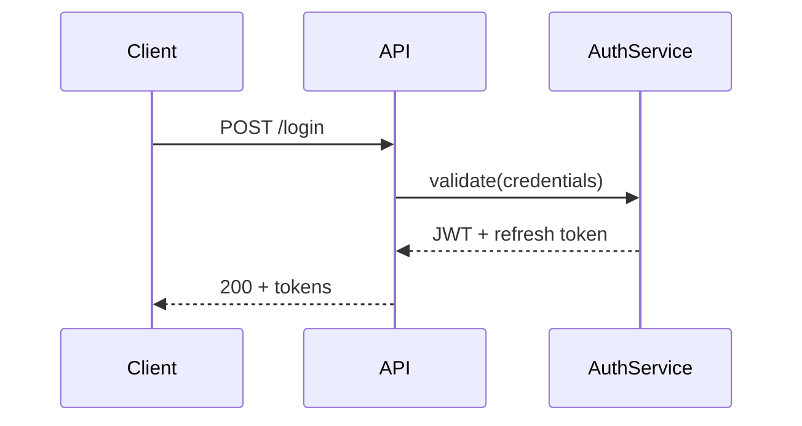

# OpenSpec Learnings

Persist exploration discoveries as structured markdown files so future proposals can build on prior knowledge.

## When This Runs

This skill activates as a **consolidation step after explore ends**. It is NOT inline during exploration. The typical flow is:

```
/opsx-explore → conversation → explore ends → THIS SKILL → learnings files written
```

Do NOT activate this skill during an active explore conversation. Wait until the user signals they are done exploring or explicitly asks to save findings.

## Instructions

### Step 1: Identify What to Capture

Review the explore conversation and extract discoveries worth persisting. Look for:

- Architecture patterns found in the codebase
- Integration points between systems
- Data flow paths traced during investigation
- Decisions made or tradeoffs evaluated
- Risks, gotchas, or hidden complexity uncovered
- API contracts, schema shapes, or protocol details
- Performance characteristics or constraints discovered

Skip ephemeral observations that only matter in the moment (e.g., "this file exists", "this function returns a string"). Focus on knowledge that would help someone writing a proposal or implementing a change.

### Step 2: Group by Topic

Organize discoveries into logical topics. Each topic becomes one file. Good topic boundaries:

- One system or subsystem per file (e.g., `auth-flow.md`, `payment-pipeline.md`)
- One integration per file (e.g., `stripe-integration.md`, `redis-caching.md`)
- One domain concept per file (e.g., `order-lifecycle.md`, `permissions-model.md`)

Use descriptive kebab-case names. Prefer specific names over generic ones:
- `auth-token-refresh.md` over `auth.md`
- `api-rate-limiting.md` over `api-notes.md`

### Step 3: Determine Where to Write

Check for active changes first:
```bash
openspec list --json
```

| Situation | Location |
|-----------|----------|
| No active change exists | `openspec/learnings/<topic>.md` (temporary buffer) |
| Active change exists | `openspec/changes/<change-name>/learnings/<topic>.md` |

If no `openspec/` directory exists in the project, do not create one. Inform the user that this skill requires OpenSpec to be initialized (`openspec init`).

Create the `learnings/` subdirectory if it does not exist.

### Step 4: Write the Learnings Files

Each file follows this structure:

```markdown
# <Topic Title>

## Context

One or two sentences explaining why this was investigated and what question it answers.

## Findings

### <Subtopic>

Key discoveries with inline code references using `file:line` format.

- JWT tokens are issued in `src/auth/issuer.ts:45` with a 1h expiry hardcoded at `src/config/auth.ts:8`
- Refresh tokens use rotation — each refresh invalidates the previous token (`src/auth/refresh.ts:23-31`)

### <Another Subtopic>

More findings organized logically.

## Flows

Use Mermaid diagrams to document flows. These are for humans reading the files later — not for the interactive conversation.



Only include flow diagrams when they add clarity. Not every learnings file needs one.

## Decisions / Open Questions

- Decision: Use token rotation instead of long-lived refresh tokens
- Open: Race condition window during concurrent refresh — needs spike

## References

- `src/auth/issuer.ts:45` — token creation
- `src/auth/refresh.ts:12-30` — refresh logic with rotation
- `src/middleware/auth.ts:8` — request authentication middleware
```

### Step 5: Confirm with User

Before writing any files, present a summary:

```
I identified N topics from the exploration:

1. auth-token-refresh — JWT lifecycle, refresh rotation, expiry config
2. api-rate-limiting — Redis-based limiter, per-endpoint config

Write these to openspec/learnings/? (or openspec/changes/<name>/learnings/)
```

Wait for confirmation. The user may want to adjust topics, merge some, or skip others.

After writing, confirm what was created:

```
Created 2 learnings files:
- openspec/learnings/auth-token-refresh.md
- openspec/learnings/api-rate-limiting.md

These will be available when you run /opsx-propose.
```

## Examples

### Example 1: Post-explore consolidation (no active change)

User ran `/opsx-explore` investigating the auth system. Conversation covered token management, session handling, and OAuth providers.

```
Agent: The explore covered several areas of the auth system.
       Want me to capture these findings in learnings files?

User: Yes

Agent: I identified 2 topics:

       1. auth-token-lifecycle — JWT issuance, refresh rotation, expiry
       2. oauth-providers — Google/GitHub integration points, callback handling

       Write these to openspec/learnings/?

User: Yes

Agent: Created 2 learnings files:
       - openspec/learnings/auth-token-lifecycle.md
       - openspec/learnings/oauth-providers.md

       These will be available when you run /opsx-propose.
```

### Example 2: Post-explore consolidation (with active change)

User ran `/opsx-explore add-dark-mode` with an active change.

```
Agent: Want me to capture the theming patterns I found?

User: Yes

Agent: I identified 1 topic:

       1. theming-patterns — CSS variable system, theme provider, color tokens

       Write to openspec/changes/add-dark-mode/learnings/?

User: Yes

Agent: Created openspec/changes/add-dark-mode/learnings/theming-patterns.md
```

### Example 3: Nothing worth capturing

```
Agent: The explore was mostly Q&A — no substantial codebase discoveries
       to persist. If you want to save anything specific, let me know.
```

## Troubleshooting

### No openspec/ directory

Cause: OpenSpec is not initialized in the project.
Solution: Tell the user to run `openspec init` first.

### Empty explore session

Cause: The conversation was brief or didn't involve codebase investigation.
Solution: Skip learnings gracefully. Not every explore needs to produce files. Say so and move on.

### Learnings directory already has files

Cause: Previous explore sessions wrote to `openspec/learnings/`.
Solution: Do not overwrite. Create new files with distinct names. If a topic overlaps with an existing file, ask the user whether to append to it or create a separate file.
